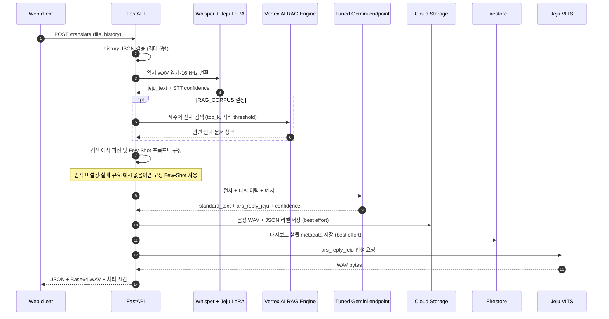

# 들엄수다 API Server | Jeju AI ARS

    

> 제주어 음성을 인식하고, 관련 안내 문맥을 바탕으로 표준어 번역과 제주어 상담 답변을 생성한 뒤 제주어 음성으로 반환하는 API입니다.

## 프로젝트 목적

Web 클라이언트의 음성 요청을 하나의 `/translate` 호출로 처리합니다. Whisper 제주어 LoRA가 발화를 전사하고, 선택적 Vertex AI RAG 검색과 튜닝된 Gemini가 번역·상담 답변을 만듭니다. Jeju VITS가 답변을 WAV로 합성하며, 입력 음성과 전사·번역 라벨은 데이터 플라이휠에서 검수하고 재학습할 수 있도록 GCS에 보관합니다.

## 핵심 기능

- `/translate`: 업로드 음성의 제주어 STT → 선택적 안내자료 RAG → Gemini 표준어 번역·제주어 ARS 답변 → VITS 음성 합성.
- 최근 대화 최대 5턴을 요청의 `history` 필드로 받아 문맥에 전달합니다. 세션 상태는 서버에 저장하지 않습니다.
- STT와 번역 confidence를 계산해 수집 샘플을 초기 `approved` 또는 `pending` 상태로 기록합니다.
- `/tts`: 텍스트를 별도 제주어 WAV 파일로 변환합니다.
- 데이터 플라이휠용 통계, 샘플 페이지, 원본 오디오 조회, 라벨 수정·검수 API를 제공합니다.
- STT LoRA와 TTS checkpoint를 로컬 경로 또는 GCS에서 적재하며 CUDA가 없으면 CPU를 사용합니다.

## 아키텍처



한 인스턴스에서는 모델 메모리 사용량을 제한하도록 추론을 `asyncio.Lock`으로 직렬화합니다. 모델은 프로세스 시작 때 적재됩니다. STT 입력은 `librosa`로 16 kHz mono로 읽으며, TTS 결과는 설정된 sample rate(기본 설정 22,050 Hz)의 WAV입니다.

## 기술 스택

| 계층 | 사용 기술 | 역할 |
|---|---|---|
| HTTP API | FastAPI, Uvicorn, Pydantic | multipart 요청 검증, JSON/WAV 응답, CORS |
| STT | Whisper, Transformers, PEFT, PyTorch, librosa | Whisper base + 제주어 LoRA 추론, confidence 계산 |
| 검색·생성 | Vertex AI RAG Engine, Google Gen AI SDK, Gemini | 안내 문서 검색과 구조화된 번역·상담 답변 생성 |
| TTS | Jeju VITS runtime, PyTorch, soundfile | 제주어 문장 분할·음성 합성·WAV 직렬화 |
| 수집·저장 | Google Cloud Storage, Firestore | 오디오/라벨 학습 원본과 대시보드 메타데이터 저장 |
| 배포 | Docker, Cloud Run | Python 3.11 컨테이너 실행 |

의존성 전체 목록은 [`requirements.txt`](requirements.txt)에, VITS 구조와 음성 처리 설정은 [`tts_config/jeju_vits.json`](tts_config/jeju_vits.json)에 있습니다.

## 설치 및 실행

Python 3.11과 Google Cloud Application Default Credentials(ADC)가 필요합니다. 기본 모델 경로는 GCS를 가리키므로 실행 계정은 해당 모델·데이터 객체에 접근할 수 있어야 합니다.

```bash
python -m pip install -r requirements.txt
python -m uvicorn api_server:app --host 0.0.0.0 --port 8080
```

Dockerfile은 VITS runtime과 `monotonic_align`을 빌드하고 Uvicorn을 실행합니다.

```bash
docker build -t korean-heritage-api .
docker run --rm -p 8080:8080 -e PORT=8080 korean-heritage-api
curl http://localhost:8080/health
```

## 환경 변수

| 변수 | 기본값 | 적용 대상 |
|---|---|---|
| `PORT` | `8080` (Dockerfile) | Uvicorn listen port |
| `CORS_ORIGINS` | `*` | 쉼표로 구분한 허용 origin |
| `GCP_PROJECT_ID` | `385248657749` | Vertex AI Gemini client project |
| `GCP_LOCATION` | `us-central1` | Gemini client region |
| `GEMINI_TUNED_ENDPOINT` | 코드에 지정된 Vertex endpoint | Gemini 번역·ARS 생성 모델 |
| `LORA_MODEL_PATH` | `gs://malmoi-jeju-dataset-2026/whisper-model-weights/whisper-jeju-lora-final` | STT adapter 디렉터리 또는 GCS prefix |
| `LORA_MODEL_CACHE_PATH` | `/tmp/whisper-jeju-lora-final` | GCS adapter 로컬 캐시 |
| `RAG_CORPUS` | 빈 문자열 | Vertex AI RAG corpus 전체 리소스명. 비어 있으면 검색 생략 |
| `RAG_TOP_K` | `3` | RAG 검색 결과 최대 개수 |
| `RAG_DISTANCE_THRESHOLD` | `0.25` | vector distance 필터 기준 |
| `TTS_CONFIG_PATH` | `./tts_config/jeju_vits.json` | VITS 모델 구조·음성 설정 JSON |
| `TTS_CHECKPOINT_PATH` | `gs://malmoi-jeju-dataset-2026/tts/jeju_vits.pth` | TTS checkpoint 로컬 경로 또는 GCS URI |
| `TTS_CHECKPOINT_CACHE_PATH` | `/tmp/jeju_vits.pth` | GCS checkpoint 로컬 캐시 |
| `VITS_ROOT` | `/opt/vits` | Docker에 고정 설치된 VITS runtime 경로 |
| `TTS_SEED` | `1234` | VITS 초기 난수 seed |
| `TTS_MAX_CHARS` | `45` | 긴 답변을 나누는 chunk 최대 문자 수 |
| `TTS_PAUSE_MS` | `220` | chunk 사이 무음 길이(ms) |
| `TTS_TAIL_SILENCE_MS` | `350` | WAV 끝 무음 길이(ms) |
| `TTS_LENGTH_SCALE` | `1.10` | VITS 발화 길이 조정값 |
| `TTS_NOISE_SCALE` | `0.667` | VITS latent noise scale |
| `TTS_NOISE_SCALE_W` | `0.35` | VITS duration noise scale |
| `DATASET_BUCKET` | `malmoi-jeju-dataset-2026` | 수집 오디오·라벨 GCS bucket |
| `DATASET_AUDIO_PREFIX` | `dataset/extracted/Audio` | WAV 객체 prefix |
| `DATASET_TEXT_PREFIX` | `dataset/extracted/Text` | JSON 라벨 객체 prefix |
| `DATASET_FIRESTORE_COLLECTION` | `dataset_samples` | 대시보드 Firestore collection |

## API 및 데이터 흐름

### 음성 상담 파이프라인

1. Web은 음성 파일을 multipart field `file`에 넣고, 대화 이력을 JSON 문자열로 인코딩해 `history` field로 전송합니다. `history`는 최대 5개 항목이며 각 항목에 `jeju_text`, `standard_text`, `ars_reply_jeju`가 필요합니다.
2. API는 음성을 임시 파일로 저장하고 16 kHz로 읽어 Whisper + LoRA에 전달합니다. 비어 있는 STT 결과는 `422`로 반환합니다.
3. 전사된 제주어 문장으로 RAG corpus를 검색합니다. 유효 문서에서 질문·안내 예시를 추출해 동적 Few-Shot을 만들며, corpus가 없거나 검색 오류/유효 예시 부재 시 기존 코드의 Few-Shot 예시를 사용합니다.
4. Gemini tuned endpoint가 입력 전사, 이력, 예시를 받아 JSON schema에 맞는 `standard_text`와 `ars_reply_jeju`를 생성합니다. API는 STT 및 Gemini 평균 token log probability를 confidence로 변환합니다.
5. API는 음성 WAV와 제주어/표준어 라벨 JSON을 GCS에 저장하고 Firestore 샘플 문서를 기록합니다. 둘은 best-effort 저장으로 실행되므로 저장 오류가 응답 처리를 중단하지 않습니다. 두 confidence가 모두 `0.8` 이상이면 `approved`/`system`, 그렇지 않으면 `pending`으로 초기화합니다.
6. 제주어 답변을 VITS로 합성한 뒤 WAV를 Base64로 인코딩해 JSON으로 반환합니다.

### 엔드포인트

| Method | 경로 | 요청 | 응답 |
|---|---|---|---|
| `GET` | `/health` | 없음 | device, STT/Gemini/TTS 적재 상태 |
| `POST` | `/translate` | multipart `file`, 선택 `history` (JSON 배열 문자열) | 전사, 번역, 상담 답변, Base64 WAV, sample rate, 처리 시간 |
| `POST` | `/tts` | JSON `{ "text": "..." }` | `audio/wav` 바이트 |
| `GET` | `/dataset/stats` | 없음 | 전체 및 pending/approved/rejected 개수 |
| `GET` | `/dataset/samples?limit=20&offset=0` | 페이지 값; limit는 1–100으로 제한 | 최신순 샘플과 전체 개수 |
| `GET` | `/dataset/audio/{sample_id}` | 샘플 ID | GCS 원본 `audio/wav` |
| `PATCH` | `/dataset/samples/{sample_id}` | status(`approved`/`rejected`), 선택 dialect/standard 라벨 | 수정된 라벨 문서 |

`/translate` 성공 응답의 주요 필드:

```json
{
  "status": "success",
  "jeju_text": "STT 제주어 전사",
  "standard_text": "표준어 번역",
  "ars_reply_text": "제주어 상담 답변",
  "audio_mime_type": "audio/wav",
  "audio_filename": "ars_reply.wav",
  "audio_sample_rate": 22050,
  "audio_base64": "...",
  "processing_time": 2.31
}
```

저장 구조에서 GCS의 오디오·라벨 JSON이 학습용 원본이며, Firestore 문서는 대시보드 조회용 복사본입니다. 사람이 승인하거나 라벨을 고치면 API는 GCS 라벨과 Firestore 문서를 함께 갱신합니다. 학습·승격 과정은 [Flywheel 저장소](https://github.com/sunghopp/Korean-Heritage-FLYWHEEL-TRAIN)를 참고하세요.

## 디렉터리 구조

```text
.
├── api_server.py             # FastAPI routes, model loading, STT/RAG/Gemini/TTS orchestration
├── ars_prompt.py             # fixed/dynamic Few-Shot prompt construction
├── gcs_model_loader.py       # GCS-to-local STT adapter loading
├── tts_engine.py             # Jeju VITS wrapper, text chunking, WAV output
├── dataset_logger.py         # GCS training sample creation
├── dataset_dashboard.py      # Firestore dashboard + GCS audio/label access
├── tts_config/jeju_vits.json
├── whisper-jeju-lora-final/  # adapter metadata
├── tests/                    # prompt and RAG retrieval tests
├── requirements.txt
└── Dockerfile
```

## 학습 및 평가 지표

### WER/BLEU 지표를 통한 모델 개선 결과

| 지표 | 베이스 모델 | 제주어 파인튜닝 | 파인튜닝 + 플라이휠 | 파인튜닝 후 변화 | 플라이휠 추가 변화 | 전체 변화 |
|---|---:|---:|---:|---:|---:|---:|
| WER (낮을수록 좋음) | 62.38% | 48.42% | **46.67%** | −13.96%p | −1.75%p | **−15.71%p** |
| BLEU (높을수록 좋음) | 57.78 | 89.14 | **90.03** | +31.36점 | +0.89점 | **+32.25점** |

### API runtime 값과 평가 지표

이 저장소의 `/translate` runtime은 발표 자료의 WER/BLEU를 매 요청 계산하지 않습니다. runtime에서 제공하는 confidence는 Whisper 및 Gemini 응답 token log probability 기반 수집 상태 보조값이며, 평가 점수와 다른 값입니다. 재학습 후보의 정량 평가는 Flywheel에서 Golden/신규 holdout WER와 Golden/validation BLEU로 실행되고 snapshot별 JSON 보고서로 기록됩니다.

## 관련 저장소

- [Korean Heritage Web](https://github.com/sunghopp/Korean-Heritage-WEB)
- [Korean Heritage Data Flywheel](https://github.com/sunghopp/Korean-Heritage-FLYWHEEL-TRAIN)
